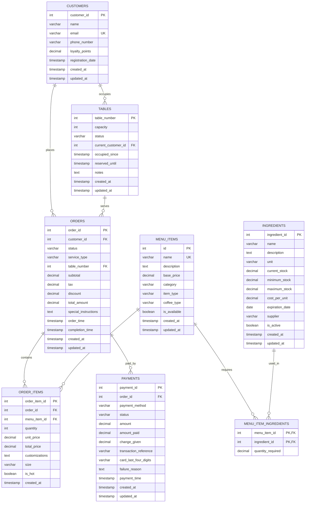

# ER Diagram - Coffee Shop Management System

## Entity Relationship Diagram

## Database Schema Overview

### Core Entities

1. **CUSTOMERS** - Thông tin khách hàng và điểm tích lũy
2. **TABLES** - Quản lý bàn và trạng thái sử dụng
3. **MENU_ITEMS** - Danh sách món ăn và đồ uống
4. **ORDERS** - Đơn hàng của khách hàng
5. **ORDER_ITEMS** - Chi tiết từng món trong đơn hàng
6. **PAYMENTS** - Thông tin thanh toán
7. **INGREDIENTS** - Nguyên liệu và kho hàng
8. **MENU_ITEM_INGREDIENTS** - Quan hệ nhiều-nhiều giữa món ăn và nguyên liệu

### Key Relationships

- **One-to-Many**: Một khách hàng có thể có nhiều đơn hàng
- **One-to-Many**: Một bàn có thể phục vụ nhiều đơn hàng
- **One-to-Many**: Một đơn hàng có nhiều món ăn
- **One-to-Many**: Một đơn hàng có thể có nhiều thanh toán
- **Many-to-Many**: Một món ăn cần nhiều nguyên liệu, một nguyên liệu có thể dùng cho nhiều món

### Business Rules

1. **Khách hàng**: Email phải duy nhất
2. **Bàn**: Mỗi bàn có thể có một khách hàng hiện tại
3. **Đơn hàng**: Phải có khách hàng và loại dịch vụ
4. **Thanh toán**: Mỗi đơn hàng có thể có nhiều phương thức thanh toán
5. **Nguyên liệu**: Theo dõi tồn kho tối thiểu và tối đa

### Views Available

1. **table_status_view** - Trạng thái hiện tại của các bàn
2. **order_summary_view** - Tóm tắt đơn hàng với thông tin khách hàng
3. **low_stock_ingredients_view** - Nguyên liệu sắp hết hàng
4. **menu_items_with_ingredients_view** - Món ăn với yêu cầu nguyên liệu

## MySQL Specific Features

- **AUTO_INCREMENT** cho primary keys
- **ENGINE=InnoDB** cho foreign key constraints
- **Triggers** để tự động cập nhật timestamp
- **Indexes** để tối ưu hiệu suất truy vấn
- **Views** để đơn giản hóa các truy vấn phức tạp

## Usage Notes

- Database được thiết kế cho MySQL với hỗ trợ SQLite
- Tất cả foreign keys có constraints để đảm bảo tính toàn vẹn dữ liệu
- Timestamps tự động cập nhật khi có thay đổi
- Có sẵn dữ liệu mẫu để test và demo
